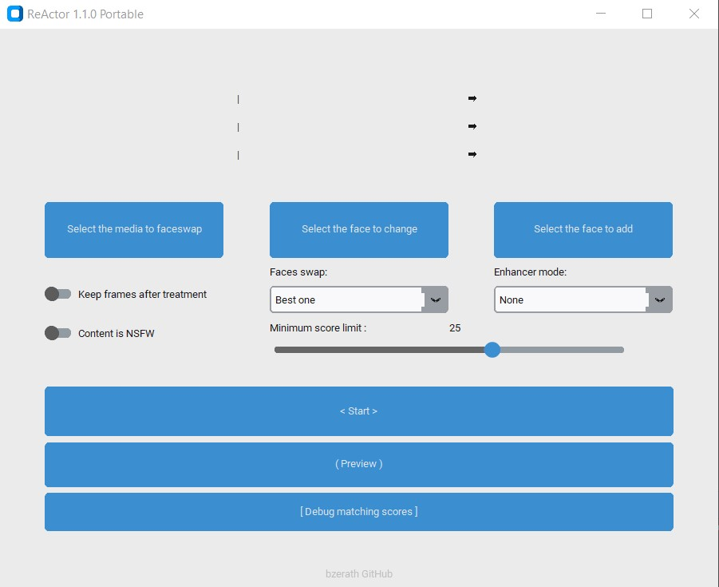

# ReActor 1.1.0 Portable

## TODO
* ~~Refacto core.py, usine à gaz.~~
* ~~Refacto ce readme~~
* Refacto frame\core.py
* Refacto face_swapper.py et face_enhancer.py pour avoir des objets plus génériques
* Permettre de reprendre un travail en cours :
  * step 1 : cases à cocher pour choisir quelles étapes sont à faire.
  * step 2 : récupération d'un dossier/travail déjà existant.
* Donner une liste de photos ou vidéos à traiter :
  * step 1 : pour chaque média, utiliser la même "face to change" et la même "face to add".
  * step 2 : pour chaque média, utiliser des "face to change" et "face to add" spécifiques.
* Traiter plusieurs personnes en même temps :
  * avoir une liste de visages à traiter :
    * step 1 : liste fixe de 3 personnes max.
    * step 2 : liste de longueur indéfinie.
* En cas d'enhance, générer la vidéo sans enhance en parallèle pour avoir un aperçu.
* Faceswap "the best ones" : faceswap tous les visages, mais que ceux inférieurs au seuil

### The Fast and Simple "roop-based*" FaceSwap application with a lot of improvements and with no forced NSFW** filter (uncensored, use it on your own responsibility)

> *[original roop](https://github.com/s0md3v/roop) is discontinued 
> **You can always toggle to SFW inside the UI

Take a video or photo and replace the face in it with a face of your choice. You only need one image of the desired face. **No dataset, no training.**

You can watch some demos [here](https://drive.google.com/drive/folders/1KHv8n_rd3Lcr2v7jBq1yPSTWM554Gq8e?usp=sharing). A StableDiffusion extension is also available, [here](https://github.com/Gourieff/sd-webui-reactor).

## Disclaimer
This software is meant to be a productive contribution to the rapidly growing AI-generated media industry. It will help artists with tasks such as animating a custom character or using the character as a model for clothing etc.

The developers of this software are aware of its possible unethical applicaitons and are committed to take preventative measures against them. It has a built-in check which prevents the program from working on inappropriate media including but not limited to nudity, graphic content, sensitive material such as war footage etc. We will continue to develop this project in the positive direction while adhering to law and ethics.

Users of this software are expected to use this software responsibly while abiding the local law. If face of a real person is being used, users are suggested to get consent from the concerned person and clearly mention that it is a deepfake when posting content online. **Developers and Contributors of this software are not responsible for actions of end-users.**

## How do I install it?

**Issues regarding installation will be closed from now on, we cannot handle the amount of requests.**

There are two types of installations: basic and gpu-powered.

- **Basic:** It is more likely to work on your computer but it will also be very slow. You can follow instructions for the basic install [here](https://github.com/s0md3v/roop/wiki/1.-Installation).

- **Acceleration:** If you have a good GPU and are ready for solving any software issues you may face, you can enable GPU which is wayyy faster. To do this, first follow the basic install instructions given above and then follow GPU-specific instructions [here](https://github.com/s0md3v/roop/wiki/2.-Acceleration).

## How do I use it?
> Note: When you run this program for the first time, it will download some models ~1Gb in size.

Executing `python run.py` command will launch this window:

* Choose a media to faceswap (photo, video).
* Select a photo of the face you wish to change. It can be a screen capture of the video, the cropped photo, anything.
* Select the face you want to replace the previous face.
* Options for faceswap:
  * None: only enhance
  * All: will faceswap every face found on each frame (= ignore "face to change")
  * Best one: will faceswap only the face that has the best similarity score, lower than "minimum score limit". 25 is a good start.
    * if no face lower than 25 is found, it will not faceswap the frame.
* Options for enhancer (warning, very long):
  * None: will not enhance the frames. The face may be pixelized because the mask is not very defined.
  * Best face only: will enhance only the face matching the "face to add".
  * Faces only: will enhance all faces
  * All: will enhance all frame. OK for photos, forget for videos.

* Start => select the output filepath and go
* Preview => for videos, allow you to get snapshots of what it will look like
* Debug matching scores => produces the media not faceswapped but with matching scores

## Credits
- [henryruhs](https://github.com/henryruhs): for being the most active contributor to the first roop project
- [ffmpeg](https://ffmpeg.org/): for making video related operations easy
- [deepinsight](https://github.com/deepinsight): for their [insightface](https://github.com/deepinsight/insightface) project which provided a well-made library and models.
- [Gourieff](https://github.com/Gourieff/ReActor-UI) for the previous version of ReActor-UI
- and all developers behind libraries used in this project.
- ETH credits : 0x54e028632dd2e9da8c15f1894a0ff97a1afa3d49
